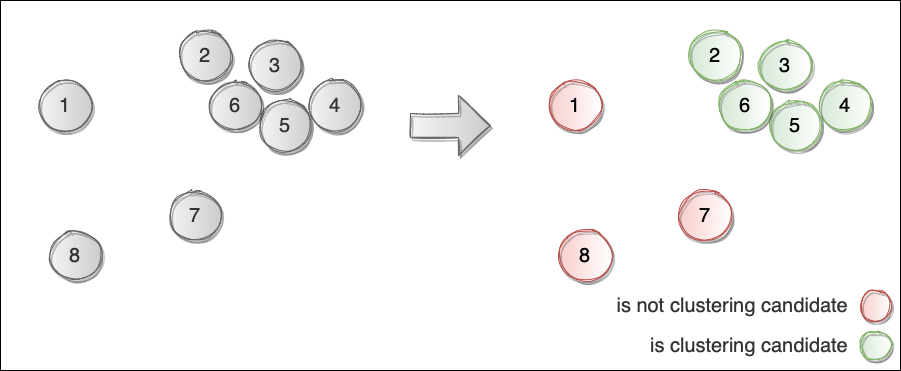

# **Architecture** ⚙️

Given part of documentation explains sequence of generic algorithm operations. Generic means that step components can be replaced by different instances and reused.

## **Steps** 👣

----

1. Preprocessing 🛠
2. Fragmentation[1] 🖇
3. Cluster 📍
4. (Optional) Classification[2] 🔵 🟣 ⚫️

## 1. **Preprocessing** 🛠

1. Generates required features
2. Drops duplicated GPS records
3. Projects coordinates from one CRS to another CRS

**Goal**: To deliver required inputs for next modules

## 2. **Fragmentation** 🖇

Classifies GPS points into 2 groups for being entered to clustering algorithm

**Goal**: to ignore GPS points candidates that are close to but unrelated to visits[1]. Created to reduce false positive clusters

* `True`: GPS point is *clustering candidate*
* `False`: GPS point is *not clustering candidate*

## 3. **Cluster** 📍

Groups clustering candidates that are similar by some parameters (example: spatial, temporal and etc) to form a points of interests (POI)

## 4. **Classification** [Optional] 🔵 🟣 ⚫️

Optional part of algorithm distinguishes *activity location* from *non-activity location* stops among the *points of interests*. As an example it can be: waste collection, fueling, traffic stop, lunch, depot and etc[2].

*NOTE*: This part is not much mobile since requires investigation customer specific activities on a fleet

## **Terminology**

----

* **Clustering candidate**: GPS point classified as `True` for being used for GPS clustering
* **POI**: Point of interests is detected cluster
* **Activity location**: Classified point of interests

## **References**

----

1. Pace-Based Clustering of GPS Data for Inferring Visit Locations and Durations on a Trip. Pablo MARTINEZ LERIN, Daisuke YAMAMOTO and Naohisa TAKAHASHI. IEICE TRANS. INF. & SYST., VOL.E97–D, NO.4 APRIL 2014
2. Identification of activity stop locations in GPS trajectories by density-based clustering method combined with support vector machines. Lei Gong, Hitomi Sato, Toshiyuki Yamamoto, Tomio Miwa, Takayuki Morikawa. Journal of Modern Transportation (2015) 23(3):202–213
