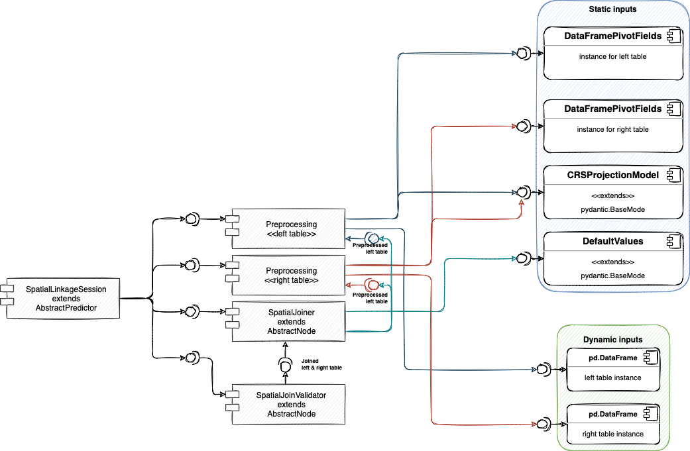

# Architecture ⚙️

Submodule of `gps_activity` package to perform spatial join between 2 source tables

## **Steps** 👣

----

1. Preprocessing 🛠
2. Spatial joiner 🖇
3. Spatial validator 🔵 🟣 ⚫️

## 1. **Preprocessing** 🛠

1. Projects lat,lon to x,y
2. Created geopandas dataframe with projected x,y
3. extraction of date

**Goal**: To deliver required inputs for next modules

## 2. **Spatial joiner** 🖇

Performs spatial join based on `geometry` column from `x,y` with specification of max distance. Uses `sjoin_nearest`

## 3. **Spatial validator**

Performs validation of spatial joins
